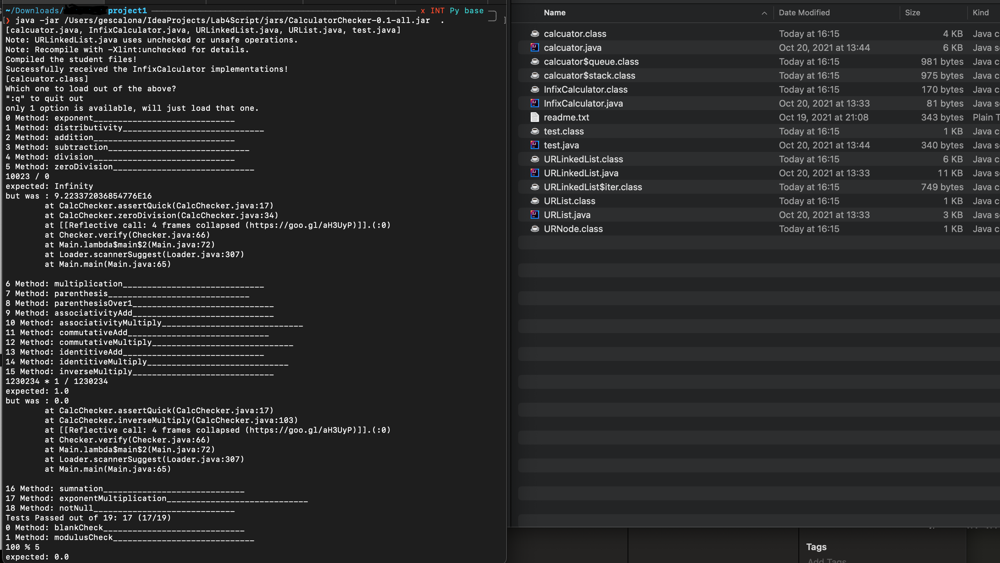
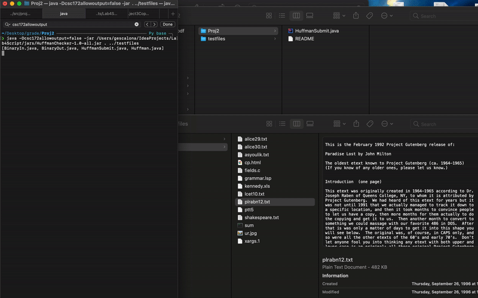

# Showcase:



## What it does
- Automatically compiles student projects
- Runs any student implemented interface against some test files
- Intercepts student input, so that you can compare it with your own.

## HOW TO COMPILE (uses gradle)
```bash
git clone <repo>
./scriptshadow.sh # may require chmod permissions
cd jars/ # all of the jars are in there!
```
## How to write checks:
- See *Checker/src/main/*Checker.java
- Sometimes it is based on an actual implemented class.

## How to add a new checker project:
- make a new folder with a `name` with a `build.gradle` file
- Go to `settings.gradle` and put `include 'name'`
- Go to said `build.gradle` and copy the other projects `build.gradle` contents into it.
- Change the name and mainClass on `build.gradle`to the appropriate names

## Resources:
- Huffman: https://corpus.canterbury.ac.nz/descriptions/ (for the testfiles)